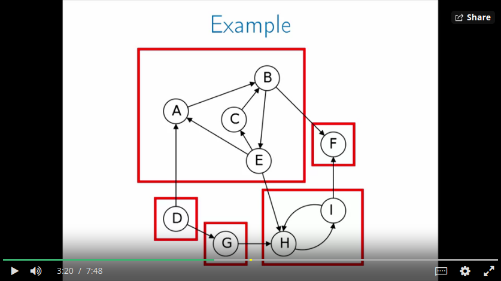
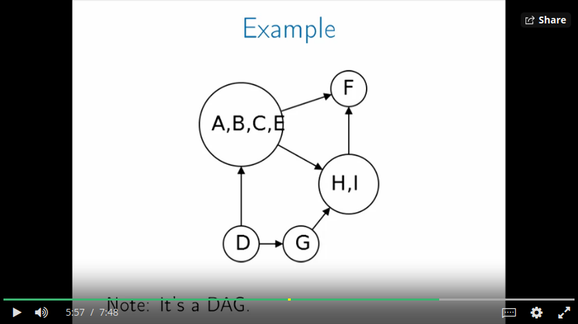
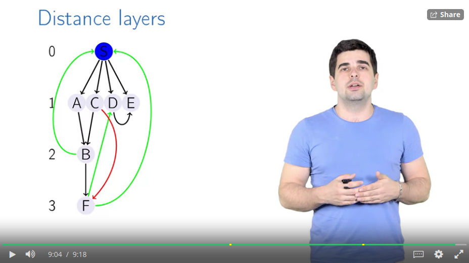

# Course 3 - Algorithms on Graphs

- Graphs:
  - Webpages connected by links
  - Computer networks
  - Social networks
  - Maps, e.g. navigation systems
  - Robot arms: Configurations/positions connected to each other by certain
    motions
	- (that's a lot like a (mathematical) group, right?)

# Week 1 - Decomposition of Graphs 1 (Undirected Graphs)

### Graph Basics

- A graph is a collection V of vertices, connected by a set of edges E
- Example: V = (A, B, C, D), Edges: (A, B), (B, D)
- A **loop** connects an edge to itself
- Sometimes two vertices can have multiple edges

- **Operations we want to implement**
  - `Is Edge?` - Is there an edge between vertex A and C?
  - `List Edge` - List all edges in the graph
  - `List Neighbors` - List all neighbors of a given vertex

- **Representing Graphs**
  - Multiple ways, each effecting the runtime. Depends on: is it a sparse or
    dense graph?
  - **Adjacency Matrix, where Entry is 1 if there is an edge, and 0 else.**
    - Is Edge? - O(1)
    - List Edge - O(|V|^2)
    - List Neighbors - O(|V|)
  - **Just store a list of all edges**
    - Is Edge? - O(|E|)
    - List Edge - O(|E|)
    - List Neighbors - O(|E|)
  - **Adjacency List: For each vertex, store a list of its connected vertices**
    - Is Edge? - O(deg) (the degree of the vertex: its number of neighbors)
    - List Edge - O(|E|)
    - List Neighbors - O(deg)

- **Runtimes**
  - depend on |V| and |E|, e.g. O(|V| + |E|) or O(|V| log |V| + |E|)
  - Which is faster? O(|V|^3/2) or O(|E|) ?
    - Depends on the **density** of the graph.
	  - Dense graph, e.g. routes between cities: |E| \approx |V|^2
      - Sparse graph, e.g. webpage links: |E| \approx |V|

### Exploring Undirected Graphs

- **Exploring**: Find everything in a "computer level", e.g. a maze, represented
  as a graph.
  - Finding routes
  - Ensuring connectivity between all vertices
  - Solving puzzles and mazes: Can I get from the start to the finish?

- A **path** is a sequence of *vertices* (not edges) s.t. for all i, `(v_i,
  v_i+1)` is an edge of G

- Basic idea: Explore every edge leaving every vertex you know
  - How to keep track of which vertices you know and which edges are still TODO?
  - Which order do you explore new edges in?
    - **Depth First**: Follow a long path forward, only backtracking when you
      hit a dead end or reach an already known vertex

- Depth first is super easy to implement recursively:
```
def explore(v):
	visited[v] = True
	for (v, w) in Edges:
		if not visited(w):
			explore(w)
```
- Need the Adjacency list representation for this algo

- **Depth First Search** can also discover **all** vertices in a graph G, not
  just the ones reachable from vertex v.
  - Just "pick" a new unvisited vertex if your `explore(v)` call finishes.
  - Total runtime: O(1) per vertex + O(1) per edge = O(|V| + |E|)

- **Connectivity** in an undirected graph
  - Partition it into **connected components** so that all nodes in a CC
    ("island") are reachable
  - Reachability is an **equivalence relation**:
    - v = v
    - if v=w then w=v
    - if v=u and v=w then u=w
- How to find all connected components?
  - Each `explore(v)` finds one complete island
  - Modify DFS to label CCs with different IDs

```
def DFS(G):
	for all v: mark v unvisited
	cc = 1  # island's ID
	for v in V:
		if not visited(v):
			explore(v)
			cc = cc + 1
```

- **Previsit and Postvisit Orderings**
  - The preorder and postorder numbers will be useful in later algorithms
  - Augment some functions to store additional information:

```
def explore(v):
	visited[v] = True
	previsit(v)
	for (v, w) in Edges:
		if not visited(w):
			explore(w)
	postvisit(v)

def previsit(v):  # same for postvisit
	pre(v) = clock
	clock = clock + 1
```

  - **Clock**
    - it ticks at each call to previsit and postvisit
    - record the time for each vertex's previsit **and postvisit** times.
  - Lemma: For any two vertices u and v, the pre(v) and post(v) times are
    **either nested or disjoint** (i.e. not interleaved).

# Week 2 - Decomposition of Graphs 2 (Directed Graphs)

- DAGs, topological orders, and creating a program for analyzing a CS curriculum
- The edges now have a *start* and *end* vertex
- DFS still works if you only follow *directed* edges.

- Tasks we want:
  - Get a *Linear Ordering* of tasks whose dependencies are stored in a DAG
  - Any (**acyclic**) DAG has a linear ordering. But cycles don't work!

- **Topological Sort**
  - A **source** vertex has no incoming edges
  - A **sink** vertex has no outgoing edges
  - **LinearOrder(G):**
    - Find a sink
	  - Follow any path as far as possible. You *will* find a sink (because the
        graph is acyclic)
    - Put at the end of the ordering
    - Remove it from graph
    - Repeat
- Runtime of LinearOrder: O(|V|) paths, each takes O(|V|) time => O(|V|^2)
  - Speed it up:
    - Only back up as far as necessary.
	  - This is exactly the Depth-First Search algorithm (the post-order)!
  - So: **TopologicalSort(G)** == DFS(G), then sort vertices by reverse
    post-order

- **Strongly Connected Components** in directed (but cyclic) graphs
  - a bit more complex than in undirected graphs; there are three possible
    scenarios for two vertices A and B:
    - A and B are connected by edges in any direction (but none may be reachable
      from the other)
      - So you can't split them into different islands, but you also can't reach
        one from the other
    - A is reachable from B, but B not from A
    - Both are reachable from the other
	  - They are **connected**
- In strongly connected components, any node is reachable from any other
  - See 
  - You can draw a **metagraph** of the SCCs
    - See 
    - The metagraph is always a DAG


- **How to compute the SCCs?**
  - Given a directed (cyclic obv.) graph G, get its SCCs
  - A simple algorithm `EasySCC` runs in O(|V|^2 + |V|*|E|)
  - Faster algo:
    - Find a *sink SCC* (a sink in the Metagraph)
	  - because exploring within a sink SCC you can be sure you won't ever land
        in a different SCC
    - It's easy to find a *source SCC* (the one with the largest *post-visit*
      number. So: **Reverse the Graph**. G^R is G with all edges reversed
      (trivial to compute).
    - And G^R and G have the same SCCs!
    - So: Find sink components of G by running DFS on G^R
- Final SCC Algorithm:
```
def SCCs(G):
	run DFS(G^R)
	let v have the largest post number
	run Explore(v)
	vertices found are the first SCC
	remove them from G and repeat
```
- You don't need to rerun DFS every time you remove a SCC. Just use the next
  highest post number in the initially computed DFS
- Essentially you run DFS on G^R, and then on G.
  - Runtime: O(|V| + |E|)
  

# Week 3 - Paths in Graphs 1 - Shortest paths in undirected graphs

- Network packets
- Flight routes:
  - What is the minimum number of flight segments to go from Hamburg to Moscow?
  - This one (and some other examples here) works on *directed* graphs though
- Car navigation
- Currency exchanges (yes rly)

### Most Direct Route

- *Length* of a path L(P) is the number of edges it walks
- The *Distance* between two vertices is the length of the shortest path between
  them
  - If you can't reach B from A, D(A, B) = infinity
- Finding the (shortest) distance from A to B is approximately the same problem
  than finding *all distances from A* in the graph.
  - BFS helps here

- **Distance Layers**
  - See 
  - There can be no edge from layer i to layer i+2 (or more). All edges go from
    layer i to layer i+1.
  - The distance between two vertices is the layer of the target vertex, when
    the source vertex is in layer 0

### Breadth-First Search

*Works the same for directed and undirected graphs*

Starting from a vertex V:

- Initialize all nodes' distance with infinity
- Discover and process the origin node V (layer 0)
- discover layer 1: All edges from the origin node. Process them:
- Take all outgoing nodes from them and discover layer 2. Ignore all edges that
  lead to nodes you already have discovered.
- etc.
- As soon as a layer leads to only already-known nodes, you're done.
- All nodes you haven't discovered yet will have the distance infinity.


- When implementing this, put all discovered nodes into a *queue*:
  - Discover all nodes
  - Only then process them


```
def BFS(G, S):
	# Graph G
	# Origin node S

	dist = []  # the distances from S to all other nodes

	for all u in V:  # all the graph's vertices
		dist[u] = infinity

	dist[S] = 0
	queue = [S]  # queue contains already discovered nodes

	while queue is not empty:
		u = dequeue(queue)
		for all (u, v) in Edges:  # ideally, traverse the adjacency list
			if dist[v] == infinity  # i.e. if the destination is yet unknown
				enqueue(queue, v)  # this means "discovering v"
				dist[v] = dist[u] + 1
```

- Running time of BFS: O(|E| + |V|)

### Shortest Path Tree

- It's a tree with node S at the root (the node where BFS started),
  and all *distance layers*.
- It is in fact a tree, i.e. it contains no cycles

To construct this tree, amend the `BFS()` algo by adding the `prev` array:

```
def BFS(G, S):
	# Graph G
	# Origin node S

	dist = []  # the distances from S to all other nodes

	for all u in V:  # all the graph's vertices
		dist[u] = infinity
		prev[u] = nil

	dist[S] = 0
	queue = [S]  # queue contains already discovered nodes

	while queue is not empty:
		u = dequeue(queue)
		for all (u, v) in Edges:  # ideally, traverse the adjacency list
			if dist[v] == infinity  # i.e. if the destination is yet unknown
				enqueue(queue, v)  # this means "discovering v"
				dist[v] = dist[u] + 1
				prev[v] = u
```

Then to reconstruct the shortest path from S to u (given the tree `prev`):

```
def ReconstructPath(S, u, prev):
	result = empty
	while u != S:
		result.append(u)
		u = prev[u]
	return reversed(result)
```

# Week 4 - Paths in Graphs 2 - Shortest paths in weighted graphs

### Fastest Route

- e.g. in navigation app
- Naive algorithm
  - Note that in an optimal path, any subpath there is also optimal
  - Store distances dist[v] as *upper bound* on the actual distance from S to v

  - *Edge relaxation* for an edge (u, v): Is it better to go from S to v through
    the node u? Does it improve the current value of dist[v]?

```
def Relax((u, v)):
	if dist[v] > dist[u] + w(u, v):
		dist[v] = dist[u] + w(u, v)
		prev[v] = u  # Remember that the node from which we came to v is now u
```

```
def Naive(G, S):
	for all u in V:  # vertices
		dist[u] = infty
		prev[u] = nil
	dist[S] = 0  # the source vertex
	do:
		relax all the edges
	while at least one `dist` changes
```

##### Dijkstra's Algorithm

- It's an efficient algorithm to find the shortest path from an original node in
  the graph to all the nodes in the graph with weighted edges where all the
  weights are non-negative
- **Main Idea**: Maintain a set R of vertices for which `dist` is already set
  correctly (the "known region").
  - In the beginning, the region R is just the starting node S
  - On each iteration we take a vertex outside of R with minimal `dist`, add it
    to R (cuz it's now optimal), and relax all its outgoing edges


```
def Dijkstra(G, S):
	for all u in V:
		dist[u] = infty
		prev[u] = nil
	dist[S] = 0
	H = MakeQueue(V)  # a priority queue with dist-values as keys

	while H is not empty:
		u = ExtractMin(H)  # remove and return the node with min distance
		for all (u, v) in G.Edges:
			if dist[v] > dist[u] + w(u, v):
				dist[v] = dist[u] + w(u, v)
				prev[v] = u
				ChangePriority(H, v, dist[v])
```

- Running time: T(MakeQueue) + |V| * T(ExtractMin) + |E| * T(ChangePriority)
  - actual running time then depends on which data structures you choose:
    - If the Priority Queue is implemented as two arrays (`current_dist` and
	  `node_is_removed`), O(|V| + |V|^2 + |E|) = O(|V|^2)
	  - because ChangePriority is constant time, but ExtractMin is O(|V|)
    - With a Binary Heap (== a prioriy queue), then ChangePriority is the most
      expensive operation:
      - O(|V| + |V| log |V| + |E| log |V|) = O((|V|+|E|) log |V|)
- The Binary Heap version is faster if number of edges is small enough, i.e. not
  in the order of |V|^2. In that case the running time would be O(|V|^2 * log
  |V|)
	

### Currency Exchange

- What if some of the edge weights are negative?
- Application: Given 1000 RUB, what path to exchange them s.t. you have maximum
  amount of USD?
- Formalized problem: Given weighted directed graph, maximize the **product**
  over the edges from USD to RUB. I.e. find a _best_ path, but now not best in
  the sense of minimum weight sum, but maximum weight product.
  - *Maximizing the product of the weights == minimizing the sum of the negative*
    log of the weigths. **So you're reducing it to a known problem!**
- Note: There can be an infinite number of paths, if you walk over an arbitrage
  exchange of, say, 3 currencies many times.


- Dijkstra doesn't work anymore when you can have negative edge weights
- Main problem: **Negative Weight Cycles**
  - If there is any cycle with the total weight sum being negative, you can just
    walk that circle forever. The distance to any node reachable from that cycle
    is minus infinity!

###### Bellman-Ford Algorithm

- Because Dijkstra doesn't work anymore
- It's very similar to the `Naive` algorithm discussed above.
  - It's slower, but it works with negative edges

```
def BellmanFord(G, S):
	# assume no negative weight cycles in G
	# Otherwise, it'll still "work", but will return incorrect distances for some nodes

	for all vertices u in V:
		dist[u] = infty
		prev[u] = nil

	dist[S] = 0

	repeat |V|-1 times:
		for all (u, v) in Edges:
	        # relax *all* edges in iteration 1, not just those reachable from S
			Relax(u, v)
		break, if no relaxation changes anything anymore
	
	
```

- Runtime of BF: O(|V|*|E|)
  - Longer than Dijkstra, but works with negative weights

- Proof of correctness hinges on the Lemma that  
	After k iterations of relaxations, for any node u, the dist[u] is the smallest length
	of a path from S to U that contains at most k edges

##### How to find negative cycles

- Use this Lemma:  
  A graph contains a negative cycle if and only if the |V|-th (additional)
  iteration of BellmanFord(G, S) updates some dist-value.

- Algorithm:
  - Run |V| iterations of Bellman-Ford, save the node v relaxed on the last iteration
  - This node v is reachable from a negative cycle
  - Walk back the path |V| times via `prev[v]`. *Now* you will definitely be
    *on* the cycle.
  - From there, just store the current vertex x and walk back until you reach x again.

##### Infinite Arbitrage

- It is possible to get an infinite amount of the target currency (vertex) u iff
  u is reachable from some node w for which dist[w] decreased on iteration |V| of
  Bellman-Ford.
  - Cause this means you have a negative cycle *from which* you can reach your
    target currency.

- Algorithm to detect IA:
  - Do |V| iterations of Bellman-Ford, save all nodes relaxed on the |V|-th iteration
    in a set A
  - Put all nodes from A into a queue Q
  - Do breadth-first search with queue Q and find all nodes reachable from A
    - (Only) Those will be the nodes for which IA will be possible

- Augment the BFS algo: During BFS, you must remember the "parent" of each
  visited node; the node from which you discovered it
- This way you can reconstruct the path to u from some node w relaxed on iteration |V|
- Go back from w to find negative cycle from which w is reachable
- Use this negative cycle to achieve infinite arbitrage from S to u
  

# Week 5 - Minimum Spanning Trees

# Week 6 - Advanced Shortest Paths Project
